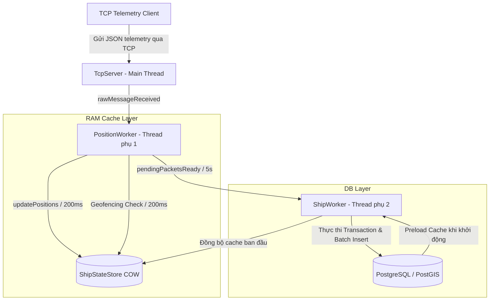
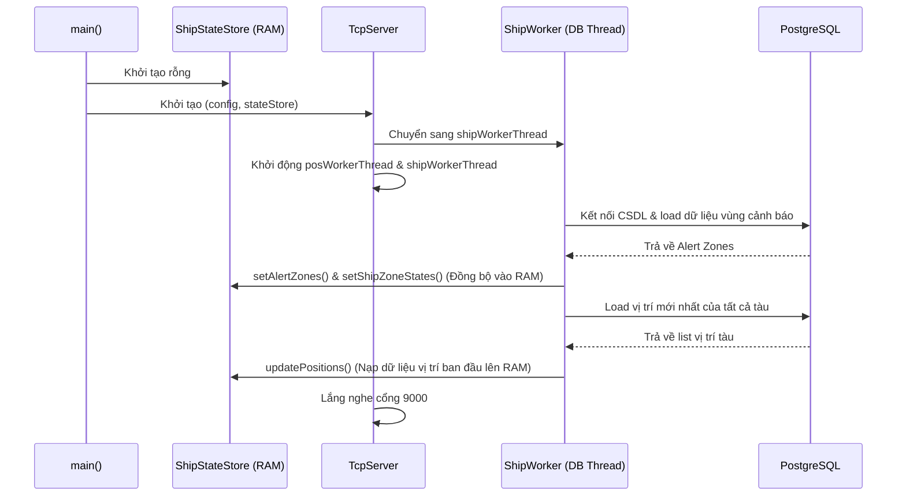
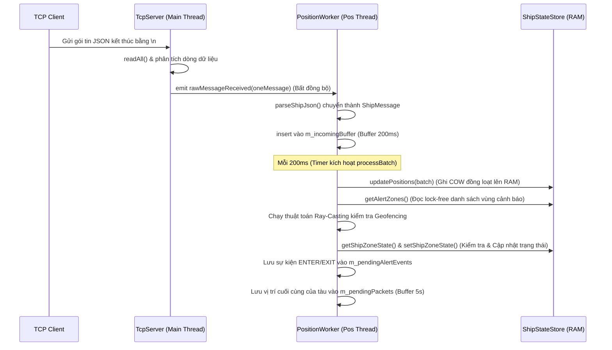
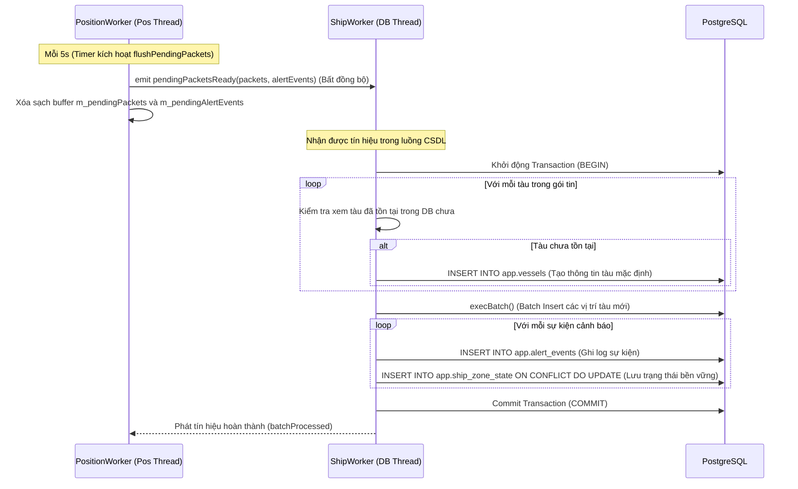
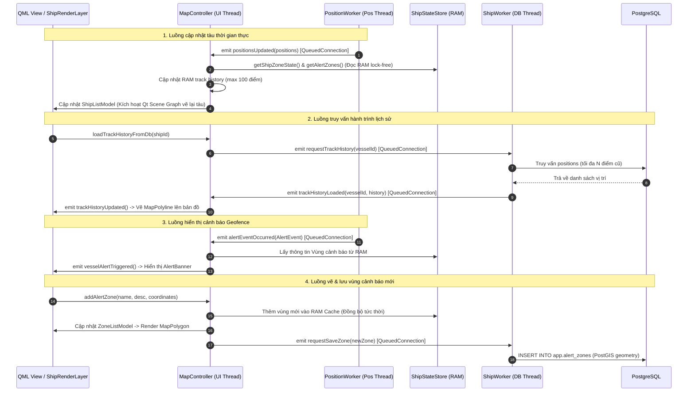

# Kiến trúc Hệ thống & Workflow - Dự án Ship Tracking

Dự án **Ship Tracking** (Bản đồ số 2D theo dõi đối tượng mặt biển thời gian thực) là một hệ thống backend xây dựng trên nền tảng **C++ (C++17)** kết hợp thư viện **Qt6** và cơ sở dữ liệu quan hệ **PostgreSQL/PostGIS**. Hệ thống được thiết kế để tiếp nhận dữ liệu telemetry từ hàng ngàn tàu biển qua giao thức TCP, lưu trữ hành trình vị trí, thực hiện kiểm tra địa lý (Geofencing) thời gian thực và đồng bộ dữ liệu hiệu năng cao.

---

## 1. Tổng quan Kiến trúc Hệ thống

Hệ thống được thiết kế theo mô hình **Layered Architecture (Kiến trúc phân tầng)** kết hợp với cơ chế **Event-driven (Hướng sự kiện)** thông qua cơ chế Signal/Slot của Qt. Để tối ưu hóa hiệu năng và tránh hiện tượng tắc nghẽn luồng xử lý chính (Main/UI Thread), hệ thống chia công việc thành 3 luồng hoạt động song song độc lập:

1. **Luồng Mạng (Main TCP Server Thread)**: Tiếp nhận các kết nối TCP từ client, đọc dữ liệu thô, tách dòng và đẩy sang hàng đợi xử lý. Luồng này hoàn toàn không thực hiện parse JSON hay thao tác CSDL để đảm bảo tốc độ phản hồi kết nối.
2. **Luồng Xử lý Vị trí & Geofencing (PositionWorker Thread)**: Parse dữ liệu JSON, gom cụm (batching) vị trí để cập nhật vào RAM DB (`ShipStateStore`) mỗi 200ms, đồng thời chạy thuật toán kiểm tra vùng địa lý (Geofencing) để phát hiện sự kiện tàu đi ra/vào vùng cảnh báo.
3. **Luồng Ghi Cơ sở Dữ liệu (ShipWorker Thread)**: Nhận các gói tin vị trí đã được tối giản và các sự kiện cảnh báo định kỳ mỗi 5 giây để thực thi lưu trữ bền vững xuống PostgreSQL thông qua các Transaction và Batch Insert.

---

## 2. Chi tiết các Phân lớp & Cấu trúc thư mục

Dự án được phân chia thành các thư mục tương ứng với chức năng trong `src/`:

### 2.1. Lớp Mô hình Dữ liệu (Model) - `src/model/`
Chứa các cấu trúc dữ liệu thuần túy (Plain Old Data - POD) để trao đổi thông tin giữa các lớp:
*   [GeoPoint.h](file:///D:/Document/LapTrinh/VDT/2D_Digital_Map/src/model/GeoPoint.h): Định nghĩa tọa độ địa lý gồm `longitude` (kinh độ) và `latitude` (vĩ độ).
*   [Vessel.h](file:///D:/Document/LapTrinh/VDT/2D_Digital_Map/src/model/Vessel.h): Thông tin tĩnh của tàu biển (`id`, `mmsi`, `name`, `callsign`, `imo`, `shipType`).
*   [VesselMessage.h](file:///D:/Document/LapTrinh/VDT/2D_Digital_Map/src/model/VesselMessage.h): Định nghĩa cấu trúc `ShipMessage` chứa thông tin hành trình (`shipId`, `longitude`, `latitude`, `speed`, `course`, `heading`, `timestamp`).
*   [AlertZone.h](file:///D:/Document/LapTrinh/VDT/2D_Digital_Map/src/model/AlertZone.h): Định nghĩa vùng cảnh báo bao gồm `id`, `name`, `description`, trạng thái kích hoạt và một danh sách điểm (`QVector<GeoPoint>`) tạo thành đa giác khép kín.
*   [AlertMessage.h](file:///D:/Document/LapTrinh/VDT/2D_Digital_Map/src/model/AlertMessage.h): Cấu trúc sự kiện cảnh báo `AlertEvent` khi tàu di chuyển qua ranh giới vùng (loại sự kiện: `ENTER` hoặc `EXIT`).

### 2.2. Lớp Truy xuất Dữ liệu (Repository) - `src/database/`
Chịu trách nhiệm giao tiếp trực tiếp với PostgreSQL thông qua module `QtSql`:
*   [PostgresConnection](file:///D:/Document/LapTrinh/VDT/2D_Digital_Map/src/database/PostgresConnection.h): Quản lý vòng đời kết nối CSDL PostgreSQL với các thông tin cấu hình (`PostgresConfig`).
*   [ShipRepository](file:///D:/Document/LapTrinh/VDT/2D_Digital_Map/src/database/ShipRepository.h): Thực hiện các truy vấn lưu trữ tàu biển, kiểm tra sự tồn tại của tàu dựa trên UUID/MMSI (sử dụng truy vấn `INSERT ... ON CONFLICT DO UPDATE`).
*   [PositionRepository](file:///D:/Document/LapTrinh/VDT/2D_Digital_Map/src/database/PositionRepository.h): Thực hiện lưu trữ vị trí của tàu. Hỗ trợ ghi đơn lẻ và ghi hàng loạt (`insertBatch`) sử dụng cơ chế gom tham số dạng mảng của Qt Sql (`execBatch`).
*   [AlertRepository](file:///D:/Document/LapTrinh/VDT/2D_Digital_Map/src/database/AlertRepository.h): Quản lý lưu/truy vấn danh sách vùng cảnh báo (chuyển đổi đa giác từ WKT - Well-Known Text sang PostGIS geography), sự kiện cảnh báo (`alert_events`) và lưu/tải trạng thái tàu nằm trong/ngoài vùng từ bảng `ship_zone_state`.
*   [RepositoryUtils.h](file:///D:/Document/LapTrinh/VDT/2D_Digital_Map/src/database/RepositoryUtils.h): Các hàm tiện ích chuyển đổi dữ liệu UUID và các kiểu hình học (Point, Polygon) giữa C++ và chuỗi định dạng WKT phục vụ cho PostGIS.

### 2.3. Lớp Quản lý Trạng thái Bộ nhớ (State Store) - `src/state/`
*   [ShipStateStore](file:///D:/Document/LapTrinh/VDT/2D_Digital_Map/src/state/ShipStateStore.h): Đây là thành phần quản lý bộ nhớ đệm (RAM Cache) của hệ thống. Nó lưu giữ vị trí mới nhất của tất cả các tàu đang hoạt động, danh sách các vùng cảnh báo và trạng thái tàu trong vùng.
    *   **Cơ chế Lock-free Read & COW (Copy-On-Write)**: Để đảm bảo việc đọc dữ liệu từ RAM phục vụ UI hoặc phân tích luôn nhanh nhất, lớp này sử dụng con trỏ `std::shared_ptr` kết hợp với các thao tác nguyên tử `std::atomic_load` và `std::atomic_store`.
    *   Khi có luồng ghi dữ liệu (ví dụ cập nhật vị trí tàu), hệ thống sẽ lock một mutex ghi (`m_writeMutex`), thực hiện nhân bản (deep copy) cấu trúc dữ liệu hiện tại, thực hiện cập nhật trên bản sao đó, rồi hoán đổi con trỏ nguyên tử thông qua `std::atomic_store`. Luồng đọc không sử dụng khóa giúp loại bỏ hoàn toàn lock contention (tranh chấp khóa) giữa luồng đọc dữ liệu thời gian thực và luồng cập nhật dữ liệu.

### 2.4. Lớp Dịch vụ Nghiệp vụ (Service) - `src/service/`
Lớp trung gian bao bọc các repository để triển khai logic nghiệp vụ:
*   [ShipService](file:///D:/Document/LapTrinh/VDT/2D_Digital_Map/src/service/ShipService.h), [PositionService](file:///D:/Document/LapTrinh/VDT/2D_Digital_Map/src/service/PositionService.h), [AlertService](file:///D:/Document/LapTrinh/VDT/2D_Digital_Map/src/service/AlertService.h).
*   [TrackingService](file:///D:/Document/LapTrinh/VDT/2D_Digital_Map/src/service/TrackingService.h): Điều phối toàn bộ quy trình kiểm tra nghiệp vụ đồng bộ bao gồm kiểm tra tàu tồn tại -> kiểm tra vùng địa lý -> ghi nhận sự kiện cảnh báo -> lưu vị trí cuối cùng. Lớp này được thiết kế theo cấu trúc Interface/Implementation rõ ràng để phục vụ việc viết unit test.

### 2.5. Lớp Xử lý Bất đồng bộ (Worker) - `src/worker/`
Thực thi các tiến trình lặp tuần hoàn hoặc xử lý hàng đợi trên các luồng phụ:
*   [ShipJsonParser](file:///D:/Document/LapTrinh/VDT/2D_Digital_Map/src/worker/ShipJsonParser.h): Parser tiện ích phân tích chuỗi JSON thô từ TCP client, chuyển đổi linh hoạt các trường định danh tàu (chấp nhận cả `shipId`, `id`, `ship_id`) và timestamp (dạng ISO-8601 hoặc số millisecond kỷ nguyên epoch).
*   [PositionWorker](file:///D:/Document/LapTrinh/VDT/2D_Digital_Map/src/worker/PositionWorker.h):
    *   Lắng nghe dữ liệu thô nhận được từ TCP thông qua khe cắm tín hiệu (slot) `processRawMessage`.
    *   Mỗi 200ms (`m_batchTimer` kích hoạt slot `processBatch`), luồng sẽ gom dữ liệu thô đã được phân tích, đẩy đồng loạt cập nhật lên RAM Cache. Sau đó chạy thuật toán Ray-Casting để xác định trạng thái di chuyển của tàu đối với các vùng cảnh báo, phát sinh các sự kiện `ENTER`/`EXIT` nếu có sự thay đổi trạng thái.
    *   Mỗi 5s (`m_timer` kích hoạt slot `flushPendingPackets`), luồng sẽ đẩy toàn bộ danh sách gói tin vị trí (đã được lọc trùng lặp chỉ giữ lại vị trí cuối cùng của mỗi tàu) và sự kiện cảnh báo sang luồng ghi DB thông qua signal `pendingPacketsReady`.
*   [ShipWorker](file:///D:/Document/LapTrinh/VDT/2D_Digital_Map/src/worker/ShipWorker.h): Chạy trên luồng CSDL chuyên biệt. Khi khởi tạo, nó preload dữ liệu từ PostgreSQL lên RAM Cache (`ShipStateStore`). Khi nhận được tín hiệu dữ liệu sẵn sàng từ `PositionWorker`, nó mở một transaction CSDL để lưu trữ hàng loạt gói tin vị trí tàu và cập nhật thông tin sự kiện cảnh báo.

### 2.6. Lớp Mạng (Network) - `src/network/`
*   [TcpServer](file:///D:/Document/LapTrinh/VDT/2D_Digital_Map/src/network/TcpServer.h): Lớp máy chủ mạng sử dụng `QTcpServer`. Lắng nghe các kết nối từ xa. Lớp này quản lý bộ đệm kết nối của từng client (`buffers`) để xử lý các gói tin TCP bị phân mảnh (đọc dữ liệu cho đến khi gặp ký tự xuống dòng `\n`). Khi nhận đủ gói tin, nó phát tín hiệu `rawMessageReceived` để chuyển dữ liệu sang luồng xử lý vị trí.

---

## 3. Quy trình Xử lý Dữ liệu (System Workflows)

### Workflow 1: Khởi động hệ thống (Bootstrapping Workflow)

### Workflow 2: Tiếp nhận và phân tích telemetry thời gian thực

### Workflow 3: Đồng bộ dữ liệu xuống Cơ sở dữ liệu bền vững (5 giây)

### Workflow 4: Hiển thị dữ liệu lên giao diện (UI Data Display & Rendering Workflow)

Quy trình hiển thị dữ liệu lên giao diện (UI) được thiết kế nhằm đảm bảo tính mượt mà (60 FPS) khi vẽ hàng ngàn tàu di chuyển thời gian thực, đồng thời duy trì tính nhất quán dữ liệu giữa luồng nghiệp vụ/CSDL và luồng giao diện chính (Main/UI Thread).

#### Chi tiết các luồng xử lý:

1. **Cập nhật và hiển thị vị trí tàu thời gian thực**:
   * **Băng qua ranh giới luồng**: Cứ mỗi `200ms`, luồng phụ [PositionWorker](file:///D:/Document/LapTrinh/VDT/2D_Digital_Map/src/worker/PositionWorker.h) phát ra tín hiệu `positionsUpdated` chứa danh sách tàu mới. Lớp [MapController](file:///D:/Document/LapTrinh/VDT/2D_Digital_Map/src/ui/MapController.h) (chạy trên Main Thread) đón nhận tín hiệu này bằng cơ chế kết nối hàng đợi `Qt::QueuedConnection`, đảm bảo an toàn luồng (thread-safety).
   * **Truy xuất thông tin Geofence**: [MapController](file:///D:/Document/LapTrinh/VDT/2D_Digital_Map/src/ui/MapController.h) truy cập nhanh vào [ShipStateStore](file:///D:/Document/LapTrinh/VDT/2D_Digital_Map/src/state/ShipStateStore.h) (RAM Cache) thông qua các hàm đọc Lock-free (`getShipZoneState`) để xác định trạng thái trong/ngoài vùng cảnh báo của các tàu vừa cập nhật.
   * **Cập nhật Model**: Dữ liệu vị trí được chuyển vào [ShipListModel](file:///D:/Document/LapTrinh/VDT/2D_Digital_Map/src/ui/ShipListModel.h) (`QAbstractListModel`), tự động kích hoạt cập nhật giao diện thông qua các cơ chế Signal/Slot của Qt Model-View.
   * **Tối ưu hóa hiển thị (Scene Graph Rendering)**: Lớp custom [ShipRenderLayer](file:///D:/Document/LapTrinh/VDT/2D_Digital_Map/src/ui/ShipRenderLayer.h) (`QQuickItem`) tiếp nhận Model cập nhật. Thay vì sinh hàng ngàn đối tượng QML nặng nề, [ShipRenderLayer](file:///D:/Document/LapTrinh/VDT/2D_Digital_Map/src/ui/ShipRenderLayer.h) thực hiện ánh xạ tọa độ (Projection) sang điểm ảnh (pixels) và tự động xây dựng lại danh sách đỉnh đồ họa (`QSGGeometry::ColoredPoint2D`). Toàn bộ tiến trình vẽ được giao cho luồng render đồ họa phần cứng chuyên biệt của Qt Scene Graph, hiển thị tàu thường có màu xanh lục/cyan và tàu cảnh báo (vi phạm Geofence) có màu đỏ nổi bật.

2. **Truy vấn và vẽ hành trình lịch sử từ cơ sở dữ liệu**:
   * **Kích hoạt sự kiện**: Khi người dùng click chọn một tàu cụ thể trên bản đồ hoặc danh sách bên lề, QML gửi yêu cầu `loadTrackHistoryFromDb(shipId)` đến [MapController](file:///D:/Document/LapTrinh/VDT/2D_Digital_Map/src/ui/MapController.h).
   * **Truy vấn bất đồng bộ**: [MapController](file:///D:/Document/LapTrinh/VDT/2D_Digital_Map/src/ui/MapController.h) phát tín hiệu `requestTrackHistory(vesselId)` yêu cầu luồng CSDL [ShipWorker](file:///D:/Document/LapTrinh/VDT/2D_Digital_Map/src/worker/ShipWorker.h) làm việc. Luồng CSDL thực hiện truy vấn thông qua repository và nạp danh sách lịch sử vị trí từ PostgreSQL/PostGIS.
   * **Vẽ hành trình**: Khi nạp xong, [ShipWorker](file:///D:/Document/LapTrinh/VDT/2D_Digital_Map/src/worker/ShipWorker.h) phát tín hiệu `trackHistoryLoaded` truyền ngược kết quả lại cho [MapController](file:///D:/Document/LapTrinh/VDT/2D_Digital_Map/src/ui/MapController.h) (UI Thread). Lịch sử được chuẩn hóa thứ tự thời gian và lưu trữ vào RAM cache tạm thời của [MapController](file:///D:/Document/LapTrinh/VDT/2D_Digital_Map/src/ui/MapController.h) (`m_trackHistories`). UI lắng nghe tín hiệu `trackHistoryUpdated` và vẽ đường nối hành trình thông qua thành phần `MapPolyline` trên lớp bản đồ OSM.

3. **Hiển thị banner cảnh báo vi phạm Geofence**:
   * Khi tàu đi vào (`ENTER`) hoặc đi ra khỏi (`EXIT`) vùng cảnh báo, luồng phụ [PositionWorker](file:///D:/Document/LapTrinh/VDT/2D_Digital_Map/src/worker/PositionWorker.h) phát tín hiệu `alertEventOccurred(AlertEvent)`.
   * [MapController](file:///D:/Document/LapTrinh/VDT/2D_Digital_Map/src/ui/MapController.h) phân tích sự kiện, giải quyết tên tàu tương ứng từ cache và tên vùng tương ứng từ [ShipStateStore](file:///D:/Document/LapTrinh/VDT/2D_Digital_Map/src/state/ShipStateStore.h).
   * Một tín hiệu `vesselAlertTriggered` được phát trực tiếp tới QML Engine. Thành phần QML [AlertBanner.qml](file:///D:/Document/LapTrinh/VDT/2D_Digital_Map/src/ui/qml/AlertBanner.qml) sẽ trượt ra từ đỉnh màn hình để hiển thị thông tin cảnh báo (Tên tàu, Trạng thái vi phạm, Tên vùng, Thời gian xảy ra) và tự động ẩn đi sau một khoảng thời gian.

4. **Tạo mới và đồng bộ vùng cảnh báo địa lý (Geofences)**:
   * **Vẽ tương tác**: Người dùng bật chế độ vẽ vùng (`isDrawingMode`) trên bản đồ và click các vị trí để tạo các đỉnh cho đa giác (`drawingPath`).
   * **Lưu vùng**: Khi nhấn nút hoàn tất, QML gọi hàm `mapController.addAlertZone`.
   * **Đồng bộ RAM Cache tức thời**: [MapController](file:///D:/Document/LapTrinh/VDT/2D_Digital_Map/src/ui/MapController.h) khép kín đa giác địa lý, chèn trực tiếp vào RAM Cache [ShipStateStore](file:///D:/Document/LapTrinh/VDT/2D_Digital_Map/src/state/ShipStateStore.h) và cập nhật [ZoneListModel](file:///D:/Document/LapTrinh/VDT/2D_Digital_Map/src/ui/ZoneListModel.h) để giao diện bản đồ vẽ ngay vùng đa giác mới thông qua thành phần `MapPolygon` của QML.
   * **Ghi đĩa bất đồng bộ**: [MapController](file:///D:/Document/LapTrinh/VDT/2D_Digital_Map/src/ui/MapController.h) đồng thời gửi tín hiệu `requestSaveZone` xuống luồng CSDL. [ShipWorker](file:///D:/Document/LapTrinh/VDT/2D_Digital_Map/src/worker/ShipWorker.h) sẽ đảm nhận việc lưu trữ đa giác mới xuống PostgreSQL/PostGIS bất đồng bộ để tránh gây treo hay đơ cứng giao diện người dùng.

---

## 4. Các tính năng và thành phần đã hoàn thiện

Dự án hiện đã hoàn thiện các tính năng cốt lõi sau:

1.  **Cơ sở dữ liệu & Migration**:
    *   Cấu hình cơ sở dữ liệu Postgres có hỗ trợ Extension không gian tự nhiên **PostGIS**.
    *   Tập tin Script migration đầy đủ tại [sql/migrations/](file:///D:/Document/LapTrinh/VDT/2D_Digital_Map/sql/migrations/) tạo cấu trúc các bảng (`vessels`, `positions`, `alert_zones`, `alert_events`, `ship_zone_state`) với các chỉ mục không gian GIST (`USING GIST (geom)`) giúp tối ưu truy vấn tọa độ địa lý.
    *   Script tự động hóa migration tại [scripts/migrate.sh](file:///D:/Document/LapTrinh/VDT/2D_Digital_Map/scripts/migrate.sh).
2.  **Cơ chế lập trình Đa luồng (Multi-threading)**:
    *   Ứng dụng chia rõ ràng nhiệm vụ mạng (TCP Server), tính toán thời gian thực (PositionWorker) và tác vụ I/O đĩa (ShipWorker) chạy trên 3 luồng riêng biệt sử dụng mô hình Signal/Slot và cơ chế hàng đợi truyền tin bất đồng bộ của Qt.
3.  **Hệ thống RAM Cache & Lock-free Reads**:
    *   Thiết kế thành công `ShipStateStore` sử dụng cơ chế Copy-On-Write (COW) kết hợp con trỏ nguyên tử để phục vụ đọc dữ liệu thời gian thực không khóa (Lock-free), đảm bảo thông tin vị trí tàu hoặc vùng cảnh báo luôn sẵn sàng cung cấp cho lớp hiển thị hoặc xử lý mà không bị nghẽn bởi các tiến trình ghi.
4.  **Tối ưu hiệu năng Xử lý Geofencing & Ghi CSDL**:
    *   Triển khai thuật toán Ray-Casting hình học chuyên biệt trong C++ tại [PositionWorker::isPointInPolygon](file:///D:/Document/LapTrinh/VDT/2D_Digital_Map/src/worker/PositionWorker.cpp#L141-L162) giúp kiểm tra vị trí tàu trong đa giác cảnh báo vô cùng nhanh chóng trên RAM mà không cần truy vấn không gian nặng nề xuống DB cho mỗi bản tin.
    *   Tối ưu hóa số lượng truy vấn đĩa bằng cách sử dụng cấu trúc **Database Transaction** và **Batch Insert** (`QSqlQuery::execBatch`) gom dữ liệu 5 giây mới ghi đĩa một lần, nâng cao đáng kể băng thông ghi dữ liệu (Throughput) của máy chủ CSDL.
5.  **Cấu trúc mã nguồn & Build System**:
    *   Mã nguồn viết theo chuẩn C++17, cấu trúc phân lớp rõ ràng, áp dụng Dependency Injection.
    *   File cấu hình [CMakeLists.txt](file:///D:/Document/LapTrinh/VDT/2D_Digital_Map/CMakeLists.txt) liên kết các module Qt6 cần thiết (`Core`, `Network`, `Widgets`, `Sql`) và tự động kích hoạt `CMAKE_AUTOMOC` xử lý siêu dữ liệu QObject.

---

## 5. Đề xuất & Các bước tiếp theo (Next Steps)

Để hoàn thiện toàn bộ ứng dụng, các bước công việc tiếp theo có thể thực hiện bao gồm:

1.  **Kịch bản Mô phỏng Client (`scripts/simulate_tcp_client.py`)**:
    *   Hoàn thiện mã nguồn Python để mô phỏng việc tạo ra hàng loạt tàu biển ảo di chuyển ngẫu nhiên và gửi dữ liệu tọa độ định kỳ lên cổng TCP 9000 dưới dạng chuỗi JSON thô để kiểm tra sức chịu tải và tính đúng đắn của thuật toán Geofencing.
2.  **Dữ liệu mẫu CSDL (`scripts/seed_db.sql`)**:
    *   Viết mã SQL chèn sẵn các thông tin tàu tĩnh giả lập và đặc biệt là vẽ sẵn một vài vùng đa giác cảnh báo địa lý (ví dụ: Vùng vịnh biển, Vùng cấm neo đậu) nhằm kiểm chứng logic phát sinh sự kiện cảnh báo của hệ thống.
3.  **Lớp hiển thị giao diện người dùng (User Interface)**:
    *   Xây dựng một module UI bản đồ 2D (có thể bằng Qt Widgets / QGraphicsView hoặc một giao diện Dashboard Web liên kết API hiển thị vị trí tàu thực tế) để trực quan hóa hành trình tàu và các cảnh báo Enter/Exit.
4.  **Hệ thống Log và Giám sát hiệu năng**:
    *   Hoàn thiện việc ghi log ra file hoặc tích hợp các công cụ thu thập số liệu (metrics) để theo dõi tốc độ xử lý gói tin trên giây (PPS) và thời gian thực thi ghi CSDL.
