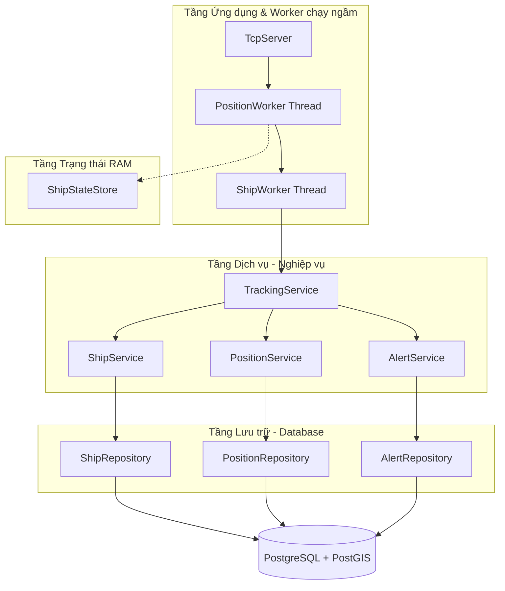
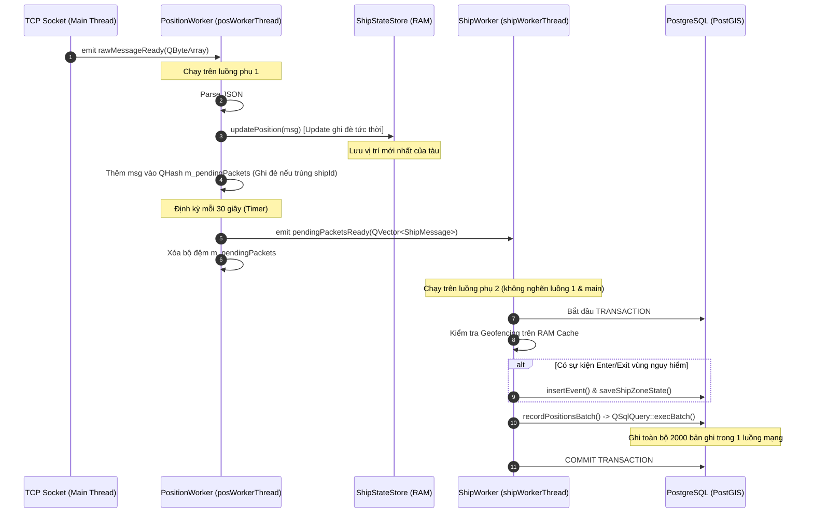

# Kiến Trúc Hệ Thống Theo Dõi Tàu Thời Gian Thực (Realtime Vessel Tracking System)

Tài liệu này mô tả chi tiết trạng thái hiện tại, kiến trúc phần mềm 3 lớp (3-Layer Architecture), thiết kế đa luồng (Multithreading), mô hình lưu trữ bộ nhớ đệm Lock-Free RAM và quy trình xử lý dữ liệu (Workflow) của chương trình.

---

## 1. Tổng Quan Trạng Thế Hệ Thống

Hệ thống được thiết kế để xử lý dữ liệu hành trình của **2000+ tàu biển cập nhật liên tục mỗi giây** qua giao thức TCP, thực hiện tính toán vùng địa lý cảnh báo (Geofencing) và lưu trữ lịch sử di chuyển với hiệu năng cao.

Hệ thống được phân bổ thành hai luồng xử lý riêng biệt:
1.  **Luồng ghi/đọc RAM (Fast Path - Realtime):** Cập nhật ngay lập tức vị trí mới nhất của tàu vào RAM để phục vụ hiển thị lên giao diện bản đồ 2D (Qt/QML) mà không gây trễ.
2.  **Luồng ghi CSDL (Slow Path - Batching):** Tích lũy vị trí mới nhất của các tàu trong vòng 30 giây, sau đó gom thành một lô (batch) và thực hiện chèn đồng loạt vào database PostgreSQL bằng luồng phụ độc lập.

---

## 2. Kiến Trúc 3 Lớp (3-Layer Architecture)

Mã nguồn được tổ chức theo cấu trúc 3 lớp rõ ràng nhằm giảm thiểu sự phụ thuộc chéo và dễ dàng bảo trì hoặc kiểm thử:



### 2.1. Tầng Lưu trữ (Repository Layer)
Chịu trách nhiệm trực tiếp giao tiếp với cơ sở dữ liệu PostgreSQL qua kết nối QtSql. Các lớp repository kế thừa giao diện ảo (Interface) tương ứng:
*   [IShipRepository](file:///D:/Document/LapTrinh/VDT/2D_Digital_Map/src/database/ShipRepository.h) / [ShipRepository](file:///D:/Document/LapTrinh/VDT/2D_Digital_Map/src/database/ShipRepository.cpp): Quản lý lưu/tìm kiếm tàu biển trong bảng `app.vessels`.
*   [IPositionRepository](file:///D:/Document/LapTrinh/VDT/2D_Digital_Map/src/database/PositionRepository.h) / [PositionRepository](file:///D:/Document/LapTrinh/VDT/2D_Digital_Map/src/database/PositionRepository.cpp): Quản lý lưu và truy vấn lịch sử tọa độ trong bảng `app.positions`. Hỗ trợ phương thức **`insertBatch`** tối ưu hóa cao qua `QSqlQuery::execBatch`.
*   [IAlertRepository](file:///D:/Document/LapTrinh/VDT/2D_Digital_Map/src/database/AlertRepository.h) / [AlertRepository](file:///D:/Document/LapTrinh/VDT/2D_Digital_Map/src/database/AlertRepository.cpp): Quản lý vùng cảnh báo (`app.alert_zones`), nhật ký sự kiện (`app.alert_events`) và lưu trạng thái cảnh báo của tàu (`app.ship_zone_state`).

### 2.2. Tầng Nghiệp vụ (Service Layer)
Nhận yêu cầu từ tầng ứng dụng, xử lý nghiệp vụ, quản lý bộ nhớ đệm (Cache) trên RAM để giảm tải truy vấn DB và chuyển dữ liệu xuống tầng lưu trữ:
*   [ShipService](file:///D:/Document/LapTrinh/VDT/2D_Digital_Map/src/service/ShipService.h): Cache danh sách các ID tàu đã đăng ký trên RAM (`m_registeredIds`), tránh SELECT DB mỗi khi nhận gói tin.
*   [PositionService](file:///D:/Document/LapTrinh/VDT/2D_Digital_Map/src/service/PositionService.h): Điều phối ghi tọa độ đơn lẻ hoặc ghi hàng loạt (batch).
*   [AlertService](file:///D:/Document/LapTrinh/VDT/2D_Digital_Map/src/service/AlertService.h): Chứa cache vùng cảnh báo và cache trạng thái "trong/ngoài" vùng của từng tàu (`m_shipZoneStates`). Thực hiện thuật toán hình học Ray Casting kiểm tra tàu nằm trong đa giác (Polygon).
*   [TrackingService](file:///D:/Document/LapTrinh/VDT/2D_Digital_Map/src/service/TrackingService.h): Bộ điều phối trung tâm. Tích hợp Geofencing, tự động sinh mã MMSI duy nhất dựa trên hàm băm UUID khi phát hiện tàu lạ chưa đăng ký, và điều hướng lưu trữ dữ liệu.

### 2.3. Tầng Ứng dụng & Trạng thái (Application & State)
*   [ShipStateStore](file:///D:/Document/LapTrinh/VDT/2D_Digital_Map/src/state/ShipStateStore.h): Đảm nhận nhiệm vụ lưu đệm vị trí tức thời (realtime state) trên RAM của tất cả các tàu đang hoạt động, phục vụ cho luồng hiển thị (UI).
*   [PositionWorker](file:///D:/Document/LapTrinh/VDT/2D_Digital_Map/src/worker/PositionWorker.h): Được chạy trên luồng ngầm `posWorkerThread` để tiếp nhận bản tin thô từ TCP, phân tích JSON, cập nhật RAM tức thì và gom bộ nhớ đệm.
*   [ShipWorker](file:///D:/Document/LapTrinh/VDT/2D_Digital_Map/src/worker/ShipWorker.h): Được chạy trên luồng ngầm `shipWorkerThread` chuyên dụng để thực thi Transaction ghi dữ liệu lớn xuống database định kỳ mà không gây nghẽn tiến trình nhận gói tin TCP.

---

## 3. Cơ Chế Lưu Trữ Đệm RAM Lock-Free (ShipStateStore)

Để đáp ứng hàng nghìn truy vấn đọc từ giao diện vẽ bản đồ song song với dòng ghi dữ liệu từ TCP, [ShipStateStore](file:///D:/Document/LapTrinh/VDT/2D_Digital_Map/src/state/ShipStateStore.cpp) áp dụng mẫu thiết kế **Lock-Free Read / Copy-On-Write (COW)**:

*   **Bộ nhớ RAM được giới hạn:** Sử dụng `QHash<QUuid, ShipMessage>` với khóa chính là `shipId`. Khi có dữ liệu mới, hàm `newStore->insert(msg.shipId, msg)` sẽ thực hiện **ghi đè (update)** lên phần tử cũ của tàu đó thay vì chèn thêm dòng mới. Bộ nhớ RAM luôn được giới hạn bằng đúng số lượng tàu thực tế đang hoạt động (ví dụ 2000 tàu chỉ tiêu tốn ~500 KB RAM), không bao giờ gây rò rỉ hay tràn bộ nhớ.
*   **Không khóa khi Đọc (Lock-free Read):**
    ```cpp
    std::optional<ShipMessage> ShipStateStore::getPosition(const QUuid &shipId) const {
        auto storePtr = std::atomic_load(&m_store); // Đọc nguyên tử con trỏ thông minh hiện tại
        auto it = storePtr->constFind(shipId);
        ...
    }
    ```
    Luồng UI có thể truy xuất bản đồ liên tục mà không cần khóa Mutex, loại bỏ hoàn toàn khả năng treo giao diện (Thread Contention).
*   **Đồng bộ hóa Luồng Ghi:** Chỉ sử dụng `std::lock_guard<std::mutex>` giữa các luồng ghi để đảm bảo các bản ghi từ TCP cập nhật một cách tuần tự vào RAM.

---

## 4. Thiết Kế Đa Luồng và Cơ Chế Batch Insert Tối Ưu

Việc phân bổ công việc qua Qt Signal/Slot (kết nối dạng `Qt::QueuedConnection`) giúp tối đa hóa khả năng xử lý bất đồng bộ:



### Ưu điểm vượt trội của cơ chế ghi lô:
1.  **Hợp nhất 30 giây:** Thay vì lưu 2000 vị trí mỗi giây xuống DB (tạo ra 60,000 lượt ghi trong 30 giây), hệ sinh thái gom lại và chỉ lưu duy nhất **1 bản tin mới nhất** của mỗi tàu tại thời điểm cuối chu kỳ. Số bản ghi giảm xuống tối đa chỉ còn 2000 bản ghi mỗi 30 giây.
2.  **Sử dụng Transaction:** Bảo vệ tính toàn vẹn dữ liệu. Nếu chèn lỗi, toàn bộ phiên chèn 2000 bản ghi sẽ lập tức được rollback.
3.  **QSqlQuery::execBatch():** Gom toàn bộ 2000 câu lệnh chèn vào driver và gửi đi dưới dạng một yêu cầu bulk-insert duy nhất. Thời gian thực thi chèn 2000 tọa độ thực tế chỉ tiêu tốn từ **15 - 35 milliseconds**, giảm thiểu tối đa tài nguyên I/O đĩa và mạng.

---

## 5. Danh Sách Các Bảng Cơ Sở Dữ Liệu (Migrations)

Các bảng dữ liệu được định nghĩa đầy đủ trong thư mục `sql/migrations/`:

| Tên Bảng | File Migration | Mục Đích | Các Trường Chính |
| :--- | :--- | :--- | :--- |
| **`app.vessels`** | `002_create_vessels.sql` | Lưu thông tin định danh tàu | `id` (UUID - PK), `mmsi` (BIGINT - Unique), `name` (TEXT), `callsign` (TEXT), `imo` (BIGINT), `ship_type` (INT) |
| **`app.positions`** | `003_create_positions.sql` | Lưu lịch sử hành trình | `id` (UUID - PK), `vessel_id` (UUID - FK), `recorded_at` (TIMESTAMPTZ), `latitude` (DOUBLE), `longitude` (DOUBLE), `speed_knots` (REAL), `course` (REAL), `heading` (INT), `geom` (GEOGRAPHY) |
| **`app.alert_zones`** | `004_create_alert_zones.sql` | Lưu đa giác vùng cảnh báo | `id` (UUID - PK), `name` (TEXT), `description` (TEXT), `enabled` (BOOLEAN), `geom` (GEOGRAPHY POLYGON) |
| **`app.alert_events`** | `005_create_alert_events.sql` | Nhật ký đi vào/ra vùng cấm | `id` (UUID - PK), `vessel_id` (UUID - FK), `alert_zone_id` (UUID - FK), `event_type` (TEXT - ENTER/EXIT), `created_at` (TIMESTAMPTZ), `position` (GEOGRAPHY) |
| **`app.ship_zone_state`** | `006_create_ship_zone_state.sql` | Lưu trạng thái hiện tại của tàu đối với vùng nguy hiểm | `ship_id` (UUID - PK, FK), `zone_id` (UUID - PK, FK), `is_inside` (BOOLEAN), `last_changed_at` (TIMESTAMPTZ) |

---

## 6. Hướng Dẫn Vận Hành và Kiểm Tra Hệ Thống

Để chạy chương trình, thực hiện các bước sau:

1.  **Cài đặt Cơ sở dữ liệu:**
    Cài đặt PostgreSQL và kích hoạt PostGIS. Tạo database và chạy lần lượt các script trong thư mục `sql/migrations` từ `001` tới `006` để thiết lập cấu trúc bảng.
2.  **Cấu hình kết nối:**
    Sửa đổi cấu hình kết nối (Host, Port, User, Password, Database Name) trong hàm `main()` tại [main.cpp](file:///D:/Document/LapTrinh/VDT/2D_Digital_Map/src/main.cpp#L14-L21).
3.  **Biên dịch:**
    ```bash
    cmake -B build
    cmake --build build
    ```
4.  **Chạy ứng dụng:**
    Chạy file thực thi `ShipTracking`. Chương trình sẽ mở TCP Server lắng nghe trên cổng `9000` sẵn sàng nhận luồng dữ liệu giả lập JSON từ Simulator gửi tới.
